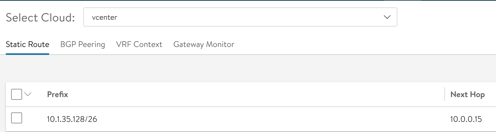

# micro8ks-ako

### AKO Installation on microK8s
Some notes about installing VMware NSX Advanced Load Balancer AKO (Avi Kubernetes Operator) on a local microk8s cluster  

### Install Kubectl
Install kubectl to control K8S once built
```
sudo apt-get install kubectl
```

### Install Helm
Install helm so you can deploy AKO helm chart
```
sudo snap install helm --classic
```

### Install Microk8s
Install microk8s. This will build a master and worker node.
```
sudo snap install microk8s --classic --channel=latest/edge/ha-preview
```

### Enable k8s DNS
Enabling k8s DNS installs a CoreDNS pod.
```
sudo microk8s enable dns
```

### Prepare kubeconfig
So you don't need to use the microk8s.kubectl command, you can fetched the kubeconfig so you can use kubectl and helm directly.
```
sudo microk8s.kubectl config view --raw > ~/.kube/config
```

### Add AKO helm repo
Add the AKO helm repo
```
helm repo add ako https://avinetworks.github.io/avi-helm-charts/charts/stable/ako
```

### Get `values.yaml` for AKO
Fetch `values.yaml` for AKO  
```
wget https://raw.githubusercontent.com/avinetworks/avi-helm-charts/master/charts/stable/ako/values.yaml
```

Modify `values.yaml` based on your deployment.  
Cluster name is `microk8s-cluster`

Assuming you are using a vCenter cloud on the Avi Controller, critical variables to modify are:

controllerVersion: “<your Avi Controller version>”
clusterName: “microk8s-cluster”
subnetIP: “<your VIP subnet>”
subnetPrefix: “<your VIP subnet prefix>”
networkName: “<port group name in vCenter where VIP subnet is>”
controllerIP: “<Avi Controller IP>”
username: “<Avi Controller username>”
password: “<Avi Controller password>”

### Add `avi-system` namespace
Create the avi-system namespace which is where the AKO agent will be installed.  
```
kubectl create ns avi-system
```

### Install AKO via helm
This will deploy and configure the AKO pod within the avi-system namespace
```
helm install ako/ako --generate-name --version 1.2.1 -f values.yaml --namespace=avi-system
```

If the AKO install works and can successfully authenticate to the Avi Controller, you will see a static route defined against your cloud



